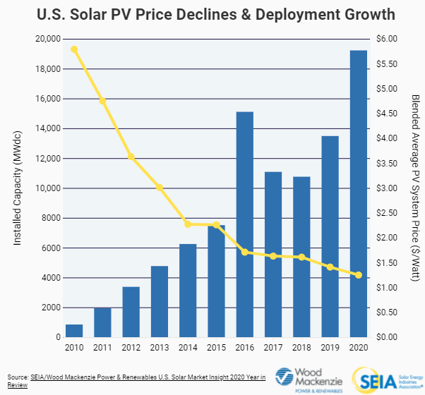
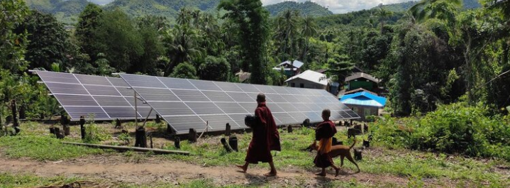

# Solar Performance Estimator
*A Project for ERHS Research Practicum - 2021*

### Problem Description
Over the past 10 years, the price of photovoltaic solar panels for electricity generation has fallen from more than $5.00 per watt to today more less than $1.00 per watt. This more than 80% reduction in cost has lead to wider adoption and larger installed capacity of solar PV in the United States and around the world. 

Decreasing prices have empowered social enterprises and nonprofits to lead the way towards rural electrification with the Solar Mini-grid. These electrical systems,comprised of photovoltaic panels, lead-acid batteries, and often diesel backup power can offer rural villages immediate access to low-emission, around-the-clock electricity without the need for grid-connected capital expenditure. However, solar Mini-grid installations are not without their own challenges.

A major challenge for Solar Mini-grid installations is ensuring proper operation and maintenance (O&M). Unlike traditional commercial or utility scale PV installations, rural solar mini-grids often lack onsite maintenance and repair expertise. Transport of material and skilled personnel to support O&M pose an organizational risk because of system remoteness. This is coupled with technological risk associated with grid and device malfunction.

This project seeks to leverage improvements in modern software and greater access to data in order to help address the above risks, known to the developer as ***the risk of remoteness.***

## The Project
This project seeks to combine low cost hardware with open source software to help Mini-grid operators and social enterprises monitor their solar-PV installations. To do this, the team will:

- Use the Open Source Python PVLib model from Sandia National Labs to build a systems model of a specified PV Array.
- Build a low cost weather station to measure pertinent performance data including DNI and ambient temperature.
- Feedback weather data to the system simulation model in order to compare simulation expectation with real performance.